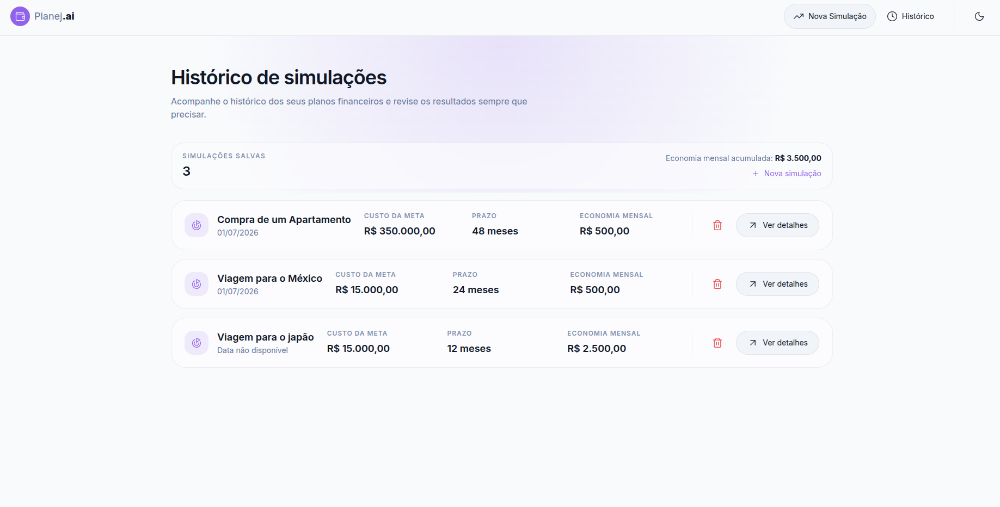
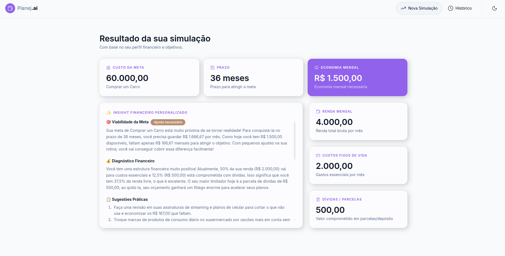
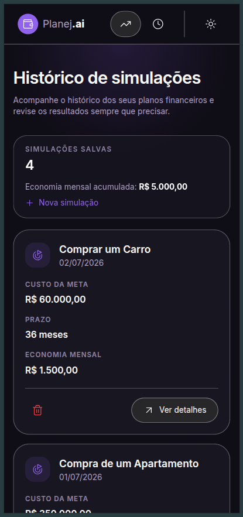
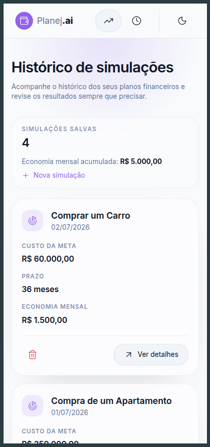
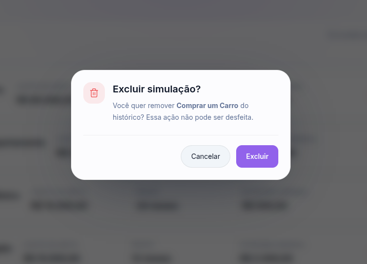

# Planej.ai

O **Planej.ai** é uma aplicação web de planejamento financeiro pessoal.  
Ele permite que o usuário informe renda, gastos, dívidas e uma meta financeira para receber um diagnóstico com base nesses dados.

O projeto funciona no navegador, salva as simulações no `localStorage` e usa a API do Google Gemini para gerar insights em linguagem simples.

## O que o projeto faz

- Recebe os dados financeiros do usuário em um formulário dividido por etapas.
- Calcula quanto sobra por mês para a meta.
- Gera uma análise automática com ajuda da IA.
- Mostra o resultado da simulação de forma clara.
- Guarda o histórico das simulações para consulta posterior.

## Como executar a aplicação

1. Instale as dependências:

```bash
npm install
```

2. Crie um arquivo `.env` na raiz do projeto com a chave da Gemini:

```env
VITE_GEMINI_API_KEY=sua_chave_aqui
```

3. Inicie a aplicação:

```bash
npm run dev
```

4. Abra o endereço mostrado no terminal, normalmente `http://localhost:5173`.
   Se o Vite abrir em outra porta, use a URL exibida no terminal.

## Tecnologias usadas

- React 19
- TypeScript
- Vite
- React Router DOM
- Tailwind CSS
- Lucide React
- localStorage do navegador
- Google Gemini API

## Principal melhoria implementada

A principal melhoria implementada foi o **histórico de simulações**.

Com isso, o usuário pode:

- ver todas as simulações já feitas;
- revisar o custo da meta, o prazo e a economia mensal;
- acompanhar a evolução da economia mensal acumulada;
- excluir uma simulação quando quiser.

## Como testar o fluxo principal

1. Abra a aplicação.
2. Preencha o formulário com renda, gastos, dívidas, meta e prazo.
3. Avance até o final do formulário.
4. Confira se a simulação foi salva e se você foi levado para a tela de resultado.
5. Verifique se o diagnóstico da IA apareceu corretamente.
6. Acesse o histórico em `/historico` para ver a simulação salva.

Se quiser testar o fluxo completo, use uma chave válida da Gemini no `.env`.

## O que aprendi

- Criar um fluxo multi-step com React.
- Trabalhar com rotas usando React Router.
- Salvar e ler dados com `localStorage`.
- Integrar uma API de IA no frontend.
- Montar prompts mais claros para receber JSON válido.
- Organizar componentes reutilizáveis para manter o projeto mais simples de evoluir.

## Exemplos visuais

### Histórico de simulações



### Resultado da simulação



### Histórico de simulações em mobile no tema dark e light





### Exclusão de simulação



## Autoria

**Andreza Freitas**

Projeto desenvolvido para fins educacionais.
